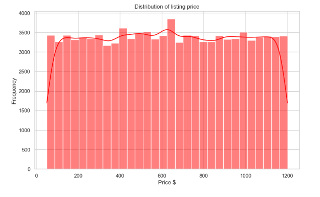

# Case Study: Uncovering Airbnb Market Insights Through Data Science  

📌 **Introduction**  

The short-term rental market, especially through platforms like Airbnb, plays a critical role in shaping urban tourism and housing dynamics. New York City, being one of the largest Airbnb markets in the world, provides a fascinating dataset to explore.  

This case study demonstrates how Exploratory Data Analysis (EDA) and Machine Learning (ML) can uncover insights into pricing, room types, and geographical patterns. The goal was to move beyond descriptive statistics and create a visually compelling and analytically rigorous narrative that highlights how location, property type, and reviews shape Airbnb prices.  

---

🔍 **Step 1: Understanding Price Distribution**  

The first step in analyzing any marketplace is to understand its pricing dynamics.  

  

The histogram above shows the distribution of listing prices across New York. The density curve indicates that while prices vary widely, most properties cluster within a mid-range band.  

**Key Insight:**  
- The market has a healthy spread, with both budget and premium listings available.  
- Extreme price outliers exist but are rare, suggesting niche luxury offerings.  
- This baseline analysis sets the stage for deeper exploration into what factors actually drive these differences.  

---

🏡 **Step 2: Price vs. Room Type**  

Not all listings are created equal. Room type is one of the most intuitive ways to segment the market.  

  

The boxplot shows price distributions across room types:  
- Entire home/apartment commands the highest median prices.  
- Private rooms are cheaper alternatives for travelers.  
- Shared rooms sit at the bottom, as expected.  
- Interestingly, hotel rooms appear as a premium category, reflecting commercial listings.  

**Key Insight:**  
- Property type strongly influences pricing.  
- Airbnb hosts can benchmark their listing strategy against these patterns.  

---

🗺 **Step 3: Geographical Distribution of Listings**  

Location is the single most powerful determinant of real estate value — and Airbnb is no exception.  

  

The scatterplot above visualizes geographical distribution of listings, with color coding by price. The heat is unmistakable:  
- Premium listings cluster around Manhattan and select areas in Brooklyn.  
- More affordable listings are spread across outer boroughs.  

**Key Insight:**  
- Proximity to city centers and tourist hotspots directly correlates with higher prices.  
- Hosts outside premium clusters may need to rely on reviews, amenities, or pricing strategies to remain competitive.  

---

🤖 **Step 4: Feature Importance via Machine Learning**  

Descriptive analysis reveals patterns, but ML provides quantitative validation. Using a Random Forest model, feature importances were extracted to identify the strongest predictors of price.  

  

**Findings:**  
- Longitude & Latitude dominate, confirming location as the top driver.  
- Reviews per month and availability indicate demand and consistency also play a key role.  
- Room type and neighborhood remain secondary but relevant factors.  

**Key Insight:**  
- What intuition suggested (location matters most) is backed by machine learning.  
- Non-obvious features like reviews and availability also influence pricing, revealing the value of social proof in digital marketplaces.  

---

🎯 **Conclusion**  

Through this project, I combined EDA, visualization, and machine learning to tell a clear, data-driven story about Airbnb pricing in New York City.  

- Exploratory Analysis showed baseline distribution and room-type effects.  
- Spatial Visualization demonstrated how geography drives market clustering.  
- Machine Learning quantified feature importance and validated patterns.  

---

🌟 **Why This Matters**  

- **For Airbnb:** This analysis can inform pricing models and recommendation engines.  
- **For Hosts:** It provides actionable strategies to optimize pricing and positioning.  
- **For Me:** This project reflects my ability to blend technical depth with clear design storytelling — a principle I bring into every data project.  
