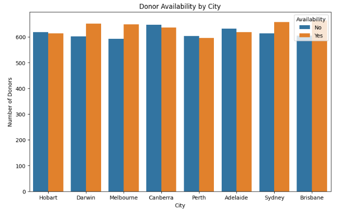
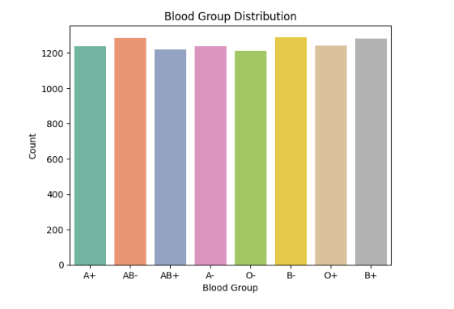
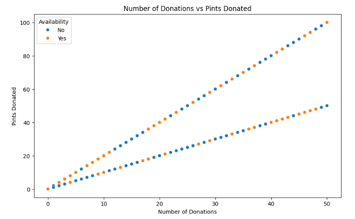
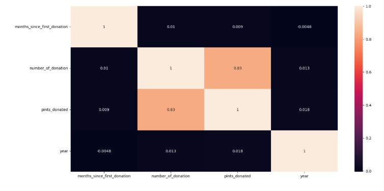

# Case Study: Understanding Blood Donor Patterns Through Data Science  

**📌 Introduction**  

Blood donation is a cornerstone of public health, ensuring a steady supply for hospitals and emergencies. Understanding donor characteristics and availability can help optimize campaigns and improve participation.  

This case study explores the Blood Donor Dataset using Exploratory Data Analysis (EDA) and Machine Learning (ML) experiments. While the dataset revealed rich descriptive insights about donations and donor demographics, it lacked predictive strength for availability. The study highlights both actionable donor trends and the importance of recognizing when ML models cannot deliver reliable outcomes.  

---

**🔍 Step 1: Donor Availability Across Cities**  
The first analysis examined how availability varied geographically.  

  

**Key Insight:**  

- Some cities consistently had more available donors, reflecting stronger engagement.  
- Urban centers contributed higher donation volumes compared to smaller towns.  
- Availability trends appeared independent of city size, suggesting cultural or campaign-driven differences.  

---

**🩸 Step 2: Blood Group Distribution & Donations**  
Blood groups play a critical role in matching supply with demand.  

  

**Findings:**  

- Apositive and Opositive were the most common groups, aligning with population-level trends.  
- Rare groups like ABnegative were underrepresented but still present in the donor pool.  
- Donation frequency was proportional to group size, with no group donating disproportionately more.  

**Key Insight:**  

Blood group distribution is balanced, but rare groups require targeted recruitment to prevent shortages.  

---

**📊 Step 3: Donation Frequency & Pints Donated**  

The relationship between donation frequency and total pints was investigated.  

  

**Findings:**  

- A strong correlation (~0.83) was observed between number of donations and pints donated.  
- More active donors naturally contributed larger volumes.  
- However, donation history did not clearly predict current availability (Yes/No).  

**Key Insight:**  
Historical activity reflects contribution levels but is not sufficient to forecast donor availability.  

---

**📈 Step 4: Correlation Heatmap**  

To validate feature relationships, a correlation heatmap was generated.  

  

**Key Insight:**  

- Strong correlation exists between donations and pints donated (~0.83).  
- Most other features showed weak or negligible correlation with availability.  
- Confirmed lack of predictive signal in the dataset.  

---

**🤖 Step 5: Machine Learning Attempts**  

To test predictability of availability (Yes/No), several ML models were applied:  
- Logistic Regression  
- Support Vector Classifier (SVC)  
- Gaussian Naive Bayes  
- Random Forest  
- Bagging, AdaBoost, and Stacking ensembles  

**Performance Summary:**  

- All models performed near random guessing (accuracy ~0.49–0.50).  
- Confusion matrices showed poor separation between Yes and No.  
- Feature engineering (scaling, categorical bins, ratios) did not improve results.  

**Key Insight:**  

The dataset lacks predictive features for availability.  
Raw and engineered features performed equally poorly, confirming low signal-to-noise ratio.  

---

**🎯 Conclusion**  

Through this project, I combined EDA, visualization, and modeling attempts to analyze blood donation behavior.  
- EDA revealed donor trends — city contributions, blood group distributions, and donation volumes.  
- Modeling showed limitations — availability could not be predicted reliably.  
- Responsible data science — instead of forcing models, I documented failures transparently, demonstrating critical thinking.  

---

**🌟 Why This Matters**  

- **For Public Health:** Insights help identify donor demographics and highlight the need for targeted campaigns.  
- **For Organizations:** Understanding weak predictive power prevents investment in flawed ML solutions.  
